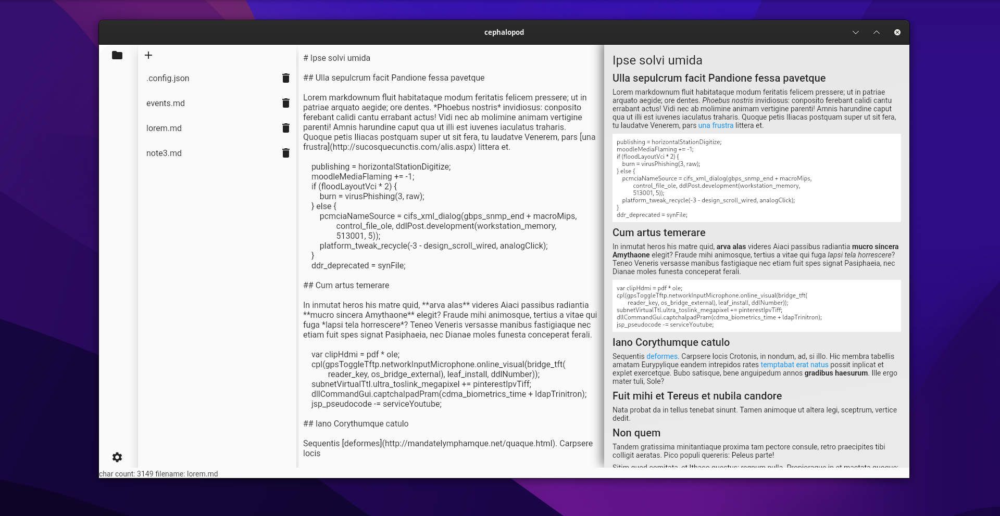

# Cepahlopod

Minimalist markdown note editor written in Flutter



## Features

- Markdown editor
- Preview
- Save and load notes
- Search (soon)
- Open any folder as a workspace(soon)
- Export notes to pdf (soon)
- Export notes to html (soon)

## Installation

```
git clone https://github.com/skynse/cephalopod

cd cephalopod

flutter packages pub get

flutter build [platform_name_here]
```